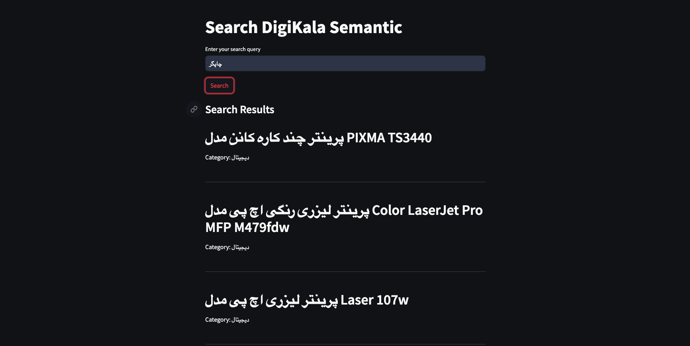
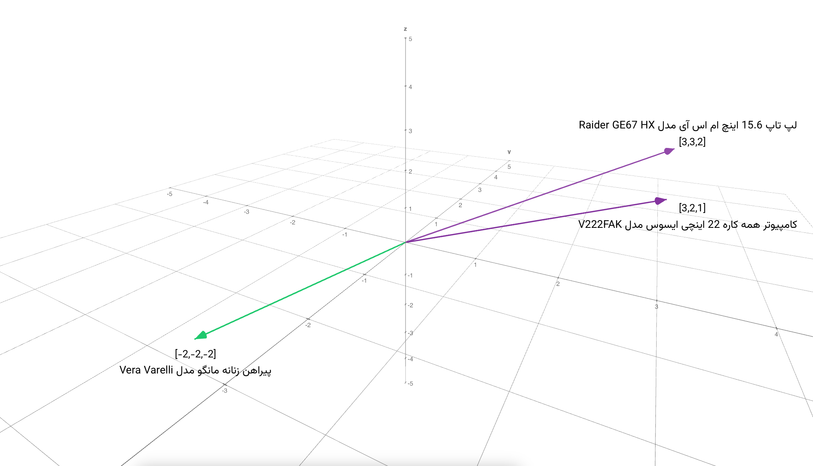

# Digikala Vector Search

This repository is a proof of concept for a semantic vector search engine for [Digikala](https://digikala.com) products. 
The search engine is based on Elasticsearch and uses the [sentence-transformers](https://www.sbert.net/) library for embeddings.

<p align="center">
  
</p>

## Overview
The project aims to provide a semantic search capability for Digikala products. This is achieved by using Elasticsearch, a powerful open-source search and analytics engine, in combination with sentence-transformers, a Python framework for state-of-the-art sentence, text and image embeddings.

The search engine works by converting product titles into 1024-dimension vectors using [intfloat/multilingual-e5-large](https://huggingface.co/intfloat/multilingual-e5-large) transformer.

<p align="center">
  
</p>

These vectors are then indexed in Elasticsearch. When a search query is made, it is also converted into a semantic vector and the closest matching vectors in the index are fetched using [Cosine Similarity](https://en.wikipedia.org/wiki/Cosine_similarity) and K-nearest neighbors (KNN), and returned as the search results.

<p align="center">
  
</p>

## Setup and Run
1. Clone the repository
```bash
git clone https://github.com/ArmanJR/Digikala-Vector-Search
cd Digikala-Vector-Search
```

2. Create virtual environment and install dependencies
```bash
python3 -m venv venv
source venv/bin/activate
pip install -r requirements.txt
```

3. Open `indexData.ipynb` and set environment variables:
- `ELASTIC_ENDPOINT`: Local or remote Elasticsearch endpoint (free trial cluster available on [Elastic Cloud](https://cloud.elastic.co/))
- `ELASTIC_USERNAME`: Username for the Elasticsearch cluster
- `ELASTIC_PASSWORD`: Password for the Elasticsearch cluster
- `ELASTIC_INDEX`: Index name for the products
- `DIGIKALA_DATASET_PATH`: The products dataset path, not available in the git repository. Download from Kaggle: [https://www.kaggle.com/datasets/radeai/digikala-comments-and-products](https://www.kaggle.com/datasets/radeai/digikala-comments-and-products?select=digikala-products.csv)
- `CUSTOM_DATASET_PATH`: Create a custom dataset containing the examples and edge cases to merge with the original dataset. It should match the format of the Digikala dataset (`id,title_fa,Rate,Rate_cnt,Category1,Category2,Brand,Price,Seller,Is_Fake,min_price_last_month,sub_category`)
- `SAMPLE_COUNT`: Number of samples to index from the full dataset (Warning: Since the vector size is 1024, setting this to a high number will consume a lot of memory and time. Keep it low for testing purposes)
- `RANDOM_STATE`: Random seed for sampling the dataset

4. Run the notebook `indexData.ipynb` step by step to index the data
5. Open `searchApp.py` and set environment variables
6. Run the search app
```bash
streamlit run searchApp.py
```

## Further Improvements
- Use a more powerful and lightweight transformer model (preferably fine-tuned on Persian content) for better embeddings
- Include images in embeddings for multimodal search
- Implement a feedback loop to improve search results over time

## License
MIT